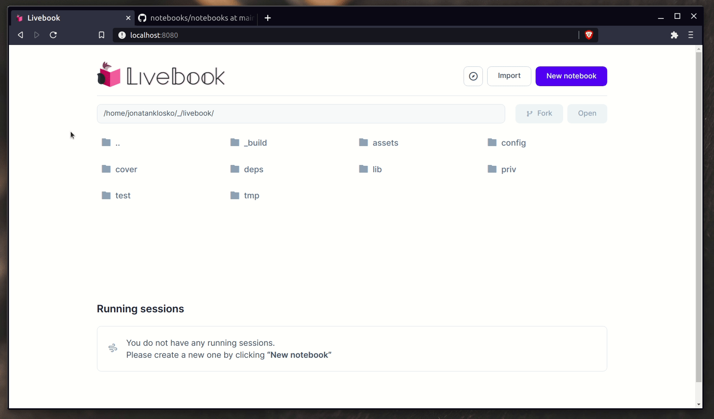

# Notebooks

A collection of [Livebook](https://github.com/elixir-nx/livebook) notebooks.

To load any of the notebooks into your local Livebook app,
all you need to do is clicking the "Import" button on the homepage
and inserting the notebook URL.

## Templates

The `templates/` directory contains blank notebooks set up for specific
use cases. You can import these to jump straight into your work 🚀
